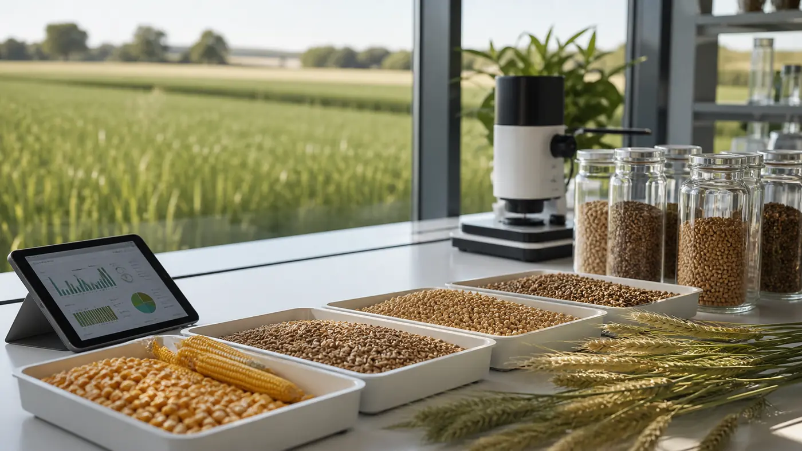
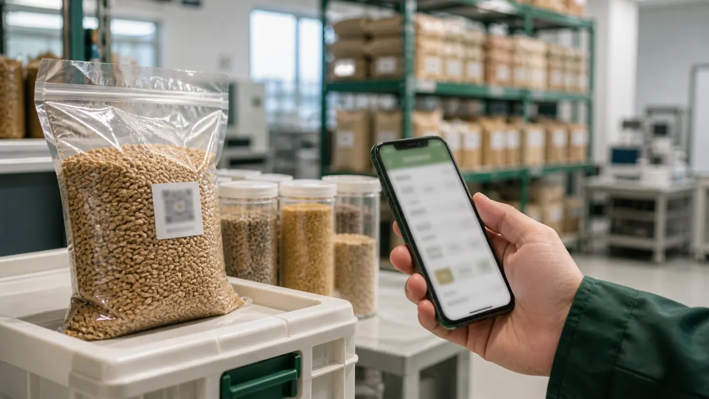
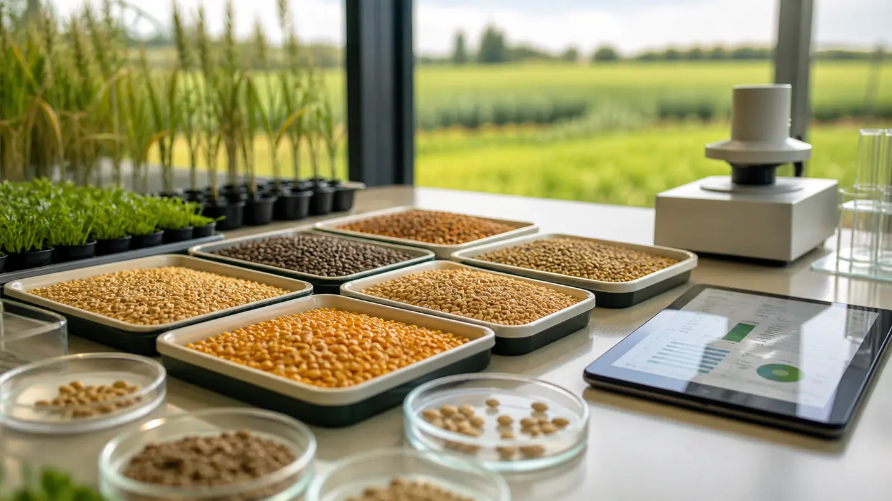

# Guyun

AI Breeding and Full-Process Grain Quality Control Front-End Showcase

## Online Showcase

The project has been deployed as an independent website and can be viewed online:

[https://www.guyunxinsheng.cn/](https://www.guyunxinsheng.cn/)

This online page is also part of my AI-assisted learning outcome. It allows reviewers to directly experience the visual design, interaction logic, and overall completion of the project.

## Screenshots







## Application Statement for the Creator Program

### 1. Applicant Background

I am a vocational college student majoring in the humanities. Before starting this project, I had no formal programming background and no experience independently developing a website or software project. Although I have long been interested in artificial intelligence, digital agriculture, and new creative tools, the technical barrier often made it difficult for me to turn my ideas into a working and presentable project.

This project is my first front-end work completed with the support of AI-assisted development, and it has also been deployed as an independent website. I would like to use it to apply for the Creator Program because it demonstrates not only a product concept for agricultural quality control, but also the possibility for non-computer-science students to learn, create, deploy, and practice with the help of AI tools.

### 2. Creation Process

The main creation process of this project took place during the May Day holiday. During that period, I focused on learning several introductory materials. I first learned that a website is usually composed of front-end and back-end parts, and then gradually understood the roles of HTML, CSS, and JavaScript: HTML structures the page, CSS controls the visual style, and JavaScript handles interaction logic.

While learning, I referred to many examples and explanations shared by online creators and tried to turn what I learned into my own project practice. Since I had no programming background, many concepts were difficult at first. I therefore used Codex and its skills to assist with writing, explanation, revision, and debugging. This process was not simple code copying; it involved repeated questioning, comparison, modification, and verification.

Through this experience, I gradually understood the complete process of turning an idea into a web project, from structure and visual design to interaction and online deployment. For me, this project is not only a finished work, but also a systematic practice of AI-assisted self-learning.

### 3. Project Motivation

Grain quality management is closely related to agricultural modernization. Traditional grain inspection often depends on manual experience and scattered records, which may lead to low efficiency, discontinuous data, and limited traceability of quality information. With the development of AI visual recognition, data analysis, and supply chain traceability, agricultural quality management can become more standardized, transparent, and intelligent.

Guyun focuses on grain sample collection, AI visual inspection, risk grading, inspection reports, batch traceability, and resource recycling. It presents these ideas through a static front-end page. The core message of the project is that AI can support not only the technology industry, but also traditional fields such as agriculture, food safety, and supply chain management.

### 4. Project Overview

This project is a static web showcase that presents a full-process quality control concept based on AI breeding, quality inspection, and batch traceability.

The page includes the following sections:

- Hero section: introduces the project theme and core capabilities
- AI breeding workflow: shows the process from raw grain sample collection to industrial application
- Batch traceability: simulates batch lookup and quality tracking information
- AI grain inspection report: simulates visual inspection results, risk levels, and handling recommendations
- Abnormal grain handling: presents abnormality detection, fermentation treatment, and farmland reuse
- Industry scenarios: presents application directions in agriculture, food safety, and supply chain management

### 5. Technical Implementation

The project is built with lightweight front-end technologies:

- HTML5: page structure and semantic content
- CSS3: responsive layout, visual hierarchy, animation, and interface styling
- Vanilla JavaScript: scroll navigation, button interactions, simulated batch lookup, and inspection report display
- WebP image assets: visual scenes for inspection, breeding, traceability, and resource recycling

The project does not use a complex framework or a back-end service. For a beginner like me, this implementation is a practical starting point for learning and presentation while keeping the structure clear and maintainable.

### 6. File Structure

```text
Guyun/
├── assets/
│   ├── scene-breeding.webp
│   ├── scene-detection.webp
│   ├── scene-hero-lab.webp
│   ├── scene-recycle.webp
│   └── scene-traceability.webp
├── README.md
├── README-EN.md
├── README-JP.md
├── index.html
├── script.js
└── style.css
```

### 7. Learning Outcomes

Through this project, I achieved the following learning outcomes:

- I understood the basic roles of HTML, CSS, and JavaScript in web development.
- I learned how to divide an abstract idea into page structure, visual design, and interaction logic.
- I learned to use AI-assisted tools for code generation, debugging, revision, and documentation.
- I realized that students without a computer science background can also create presentable technical works through continuous learning and suitable tools.
- I gained a deeper understanding of how digital technology can support agricultural quality management, food safety, and supply chain transparency.

For me, this project is not only a technical exercise. It is also a meaningful step from “not knowing how to program” to “being able to express and implement an idea.”

### 8. Reasons for Applying to the Creator Program

I am applying for the Creator Program because I believe creation should not be limited to people who already have professional programming skills. AI tools are lowering the barrier to technical expression and allowing people from different academic and professional backgrounds to participate in digital creation and application design.

If I am accepted into the Creator Program, I hope to continue improving this project and create more content around “AI + agricultural quality management,” including project iteration records, learning notes, interface improvement processes, multilingual documentation, and beginner-friendly experiences in AI-assisted development.

I hope this project can show that even without a traditional programming background, a person with clear problem awareness, continuous learning, and appropriate AI tools can create work with a theme, structure, and practical value.

### 9. Future Plan

I plan to continue improving the project in the following directions:

- Improve the writing and visual details to make the presentation more professional
- Strengthen mobile responsiveness and accessibility
- Expand the static showcase into an interactive prototype with a clearer data structure
- Learn basic data storage, API usage, and AI model integration
- Record the creation process from idea to implementation as a useful case study for beginners

### 10. Note

This project is currently a static front-end showcase. The inspection results, batch information, and AI analysis shown on the page are demonstration data and do not represent the output of a real inspection system.

The project has been deployed at [https://www.guyunxinsheng.cn/](https://www.guyunxinsheng.cn/). Reviewers can view the live work online and can also inspect the source files through `index.html`, `style.css`, `script.js`, and the image assets in `assets/`.

## Languages

- [中文](README.md)
- English: current document
- [日本語](README-JP.md)
